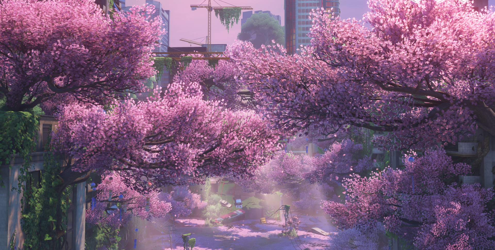
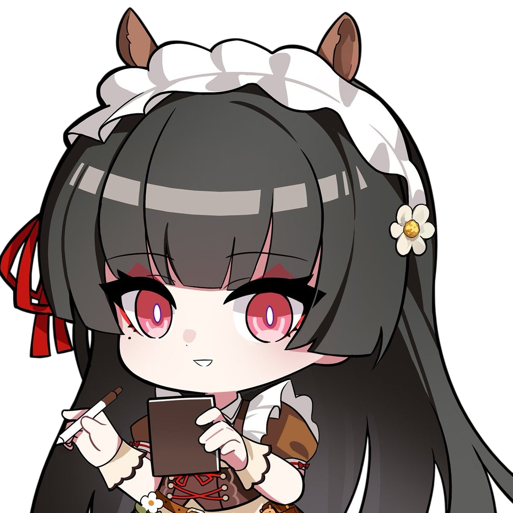
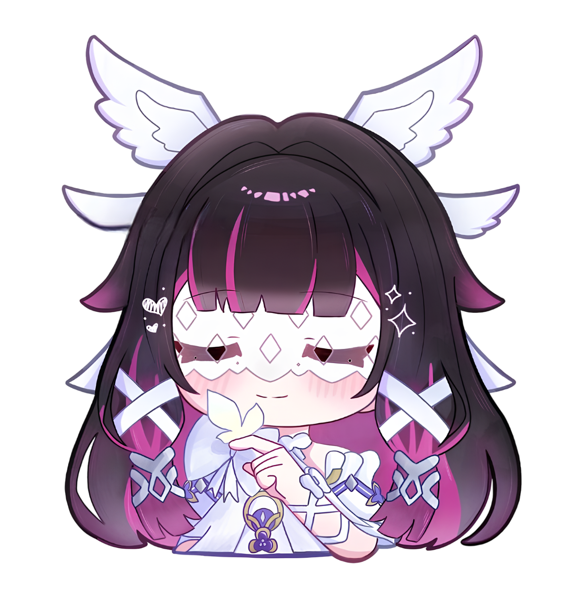
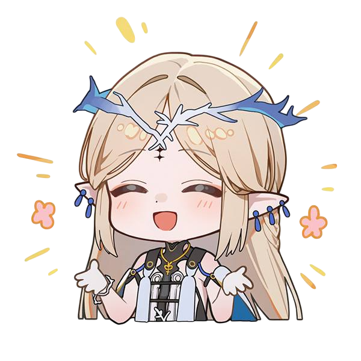

<!-- Banner -->

  

<!--About Me -->

  <h3 align="center">About Me </h3>
 

𝑰 𝒅𝒆𝒗𝒆𝒍𝒐𝒑 𝑨𝑰-𝒑𝒐𝒘𝒆𝒓𝒆𝒅 𝒂𝒑𝒑𝒍𝒊𝒄𝒂𝒕𝒊𝒐𝒏𝒔, 𝒊𝒏𝒕𝒆𝒓𝒂𝒄𝒕𝒊𝒗𝒆 𝒃𝒐𝒕𝒔, 𝒂𝒏𝒅 𝒄𝒉𝒂𝒓𝒂𝒄𝒕𝒆𝒓-𝒅𝒓𝒊𝒗𝒆𝒏 𝒔𝒚𝒔𝒕𝒆𝒎𝒔.

𝑴𝒚 𝒘𝒐𝒓𝒌 𝒊𝒏𝒄𝒍𝒖𝒅𝒆𝒔 𝒃𝒂𝒄𝒌𝒆𝒏𝒅 𝒍𝒐𝒈𝒊𝒄, 𝒘𝒆𝒃 𝒂𝒑𝒑𝒍𝒊𝒄𝒂𝒕𝒊𝒐𝒏𝒔, 𝒂𝒏𝒅 𝒔𝒎𝒂𝒍𝒍 𝒑𝒓𝒐𝒋𝒆𝒄𝒕𝒔 𝒕𝒉𝒂𝒕 𝒄𝒐𝒎𝒃𝒊𝒏𝒆 𝑨𝑰 𝒘𝒊𝒕𝒉 𝒑𝒓𝒂𝒄𝒕𝒊𝒄𝒂𝒍 𝒇𝒖𝒏𝒄𝒕𝒊𝒐𝒏𝒂𝒍𝒊𝒕𝒚.

𝑰’𝒎 𝒅𝒓𝒂𝒘𝒏 𝒕𝒐 𝒊𝒎𝒂𝒈𝒊𝒏𝒂𝒕𝒊𝒗𝒆 𝒘𝒐𝒓𝒍𝒅𝒔 — 𝒂𝒏𝒊𝒎𝒆 𝒂𝒏𝒅 𝒔𝒕𝒐𝒓𝒊𝒆𝒔 𝒘𝒉𝒆𝒓𝒆 𝒇𝒂𝒏𝒕𝒂𝒔𝒚 𝒂𝒏𝒅 𝒆𝒎𝒐𝒕𝒊𝒐𝒏 𝒄𝒐𝒍𝒍𝒊𝒅𝒆.

𝑻𝒉𝒆𝒔𝒆 𝒊𝒏𝒕𝒆𝒓𝒆𝒔𝒕𝒔 𝒐𝒇𝒕𝒆𝒏 𝒊𝒏𝒔𝒑𝒊𝒓𝒆 𝒂𝒏𝒅 𝒎𝒐𝒕𝒊𝒗𝒂𝒕𝒆 𝑰 𝒊𝒎𝒑𝒍𝒆𝒎𝒆𝒏𝒕 𝒊𝒏 𝒎𝒚 𝒑𝒓𝒐𝒋𝒆𝒄𝒕𝒔. 𝑰 𝒆𝒏𝒋𝒐𝒚 𝒆𝒙𝒑𝒆𝒓𝒊𝒎𝒆𝒏𝒕𝒊𝒏𝒈 𝒘𝒊𝒕𝒉 𝒏𝒆𝒘 𝒊𝒅𝒆𝒂𝒔, 𝒆𝒙𝒑𝒍𝒐𝒓𝒊𝒏𝒈 𝒄𝒓𝒆𝒂𝒕𝒊𝒗𝒆 𝒑𝒐𝒔𝒔𝒊𝒃𝒊𝒍𝒊𝒕𝒊𝒆𝒔, 𝒂𝒏𝒅 𝒃𝒍𝒆𝒏𝒅𝒊𝒏𝒈 𝒊𝒎𝒂𝒈𝒊𝒏𝒂𝒕𝒊𝒐𝒏 𝒘𝒊𝒕𝒉 𝒄𝒐𝒅𝒆 𝒊𝒏 𝒘𝒂𝒚𝒔 𝒕𝒉𝒂𝒕 𝒇𝒆𝒆𝒍 𝒏𝒂𝒕𝒖𝒓𝒂𝒍 𝒂𝒏𝒅 𝒑𝒍𝒂𝒚𝒇𝒖𝒍.

<!-- Tech Stack GIF  -->
<h3 align="left">Languages</h3>
   

  <!-- Languages -->

  <!-- Right: Image -->
   
  

 

<h3 align="left">Frameworks & Libraries</h3>
 

   <!-- Right: Image -->
  

 

<h3 align="left">Tools & Platforms</h3>
   

  <!-- Right: Image -->
  

 

<!-- Projects -->
## 📂 My Projects

### 

---

<!-- Contact Me -->

  <i>
𝗜'𝗠 𝗔 𝗖𝗨𝗥𝗜𝗢𝗨𝗦 𝗣𝗘𝗥𝗦𝗢𝗡 
𝗪𝗛𝗢 𝗘𝗡𝗝𝗢𝗬𝗦 𝗟𝗘𝗔𝗥𝗡𝗜𝗡𝗚, 
𝗘𝗫𝗣𝗟𝗢𝗥𝗜𝗡𝗚 𝗜𝗗𝗘𝗔𝗦, 
𝗔𝗡𝗗 𝗜𝗠𝗣𝗥𝗢𝗩𝗜𝗡𝗚 𝗪𝗜𝗧𝗛 𝗘𝗔𝗖𝗛 𝗦𝗧𝗘𝗣. 
𝗧𝗛𝗘𝗥𝗘’𝗦 𝗔𝗟𝗪𝗔𝗬𝗦 𝗦𝗢𝗠𝗘𝗧𝗛𝗜𝗡𝗚 𝗡𝗘𝗪 
𝗧𝗢 𝗨𝗡𝗗𝗘𝗥𝗦𝗧𝗔𝗡𝗗, 
𝗔𝗡𝗗 𝗧𝗛𝗔𝗧’𝗦 𝗪𝗛𝗔𝗧 𝗞𝗘𝗘𝗣𝗦 𝗠𝗘 𝗠𝗢𝗩𝗜𝗡𝗚. 
𝗜𝗙 𝗬𝗢𝗨 𝗘𝗩𝗘𝗥 𝗪𝗔𝗡𝗧 𝗧𝗢 𝗦𝗛𝗔𝗥𝗘 𝗔 𝗧𝗛𝗢𝗨𝗚𝗛𝗧 
𝗢𝗥 𝗜𝗗𝗘𝗔, 
𝗙𝗘𝗘𝗟 𝗙𝗥𝗘𝗘 𝗧𝗢 𝗥𝗘𝗔𝗖𝗛 𝗢𝗨𝗧 —

  </i>

 

   

 

 

<!-- Byee -->

  

  <h3 align="center" style="font-weight: normal; font-family: 'Segoe UI', sans-serif;">
   Ｔｈａｎｋｓ　ｆｏｒ　ｂｅｉｎｇ　ｈｅｒｅ．
Ｉ　ｈｏｐｅ　ｔｈｅｓｅ　ｓｍａｌｌ　ｃｒｅａｔｉｏｎｓ　ａｄｄ　ａ　ｔｏｕｃｈ　ｏｆ　ｉｍａｇｉｎａｔｉｏｎ　ｔｏ　ｙｏｕｒ　ｗｏｒｌｄ．
  </h3>
   
  

